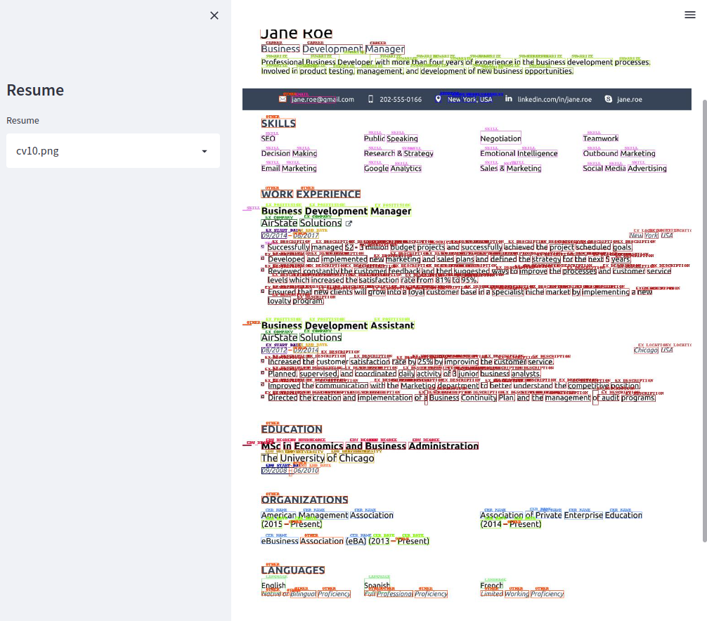

# Resume Parser Project

## Target

- Create meta data from any Resume
- Ranking match with JD from HR (**In future**)

## ABOUT

### Many tag (27 tag)

- NAME
- EMAIL
- ADDRESS
- PHONE
- URL
- EXPERIMENT

  - COMPANY
  - POSITION
  - START TIME
  - END TIME
  - DESCRIPTION
- EDUCATION

  - DEGREE
  - UNIVERSITY NAME
  - START TIME
  - END TIME
- LANGUAGE
- AWARD NAME
- PERSONAL PROJECT

  - NAME
  - START DATE
  - END DATE
  - DESCRIPTION
- CERTIFICATION

  - NAME
  - DATETIME
  - SKILL
- SKILLS
- CAREER
- SUMARIZE

## DEMO

You can download [pretrain model](https://drive.google.com/file/d/1WxHBGETkX01Hiwug4V5yfg4inbglhK7h/view?usp=sharing) or training

When you have model. Typing the command. Each command is one teminal.

```
# create server
make server

# create app
make app

# External api
make external
```

Some best results

```

```


## TODO

- Add more dataset with many layout
- Change metrics with F1-score for IO tag
